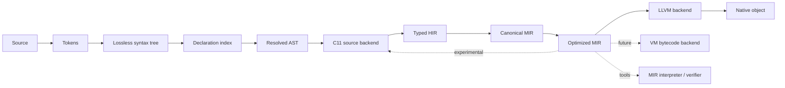

# Compiler Pipeline

## Overview

Only the dashed consumers are optional. The front end, compile-time engine, and
HIR-to-MIR contract are compiler-core components and do not depend on LLVM.

## Front end

### Source management and lexing

The compiler assigns stable file and span identifiers, preserves comments and
trivia for tooling, and emits tokens without performing semantic lookup.

### Lossless syntax tree

The syntax tree supports formatting, editor features, recovery from incomplete
programs, and precise diagnostics. It follows a Luau-derived grammar with
documented Pop Lang extensions. Parser recovery nodes do not pass unexamined
into HIR.

### Declaration index

Before checking bodies, the compiler indexes namespace/using headers, Bubble
references, declaration visibility, type names, function signatures, classes,
attributes, and constants. This makes
declaration identity available without executing compile-time code and prevents
attributes from changing how their surrounding source is parsed.

### Name and module resolution

Resolution builds Module and Bubble dependency graphs and maps every name
use to a symbol. Using directives, aliases, overload candidates, visibility, UDA
names, and type/value namespaces are resolved here. A `using` never becomes a
runtime operation.

### Type checking and inference

Type checking performs constraint generation, local inference, generic
instantiation, flow-sensitive narrowing, exhaustiveness analysis, and dispatch
selection. Every successful expression receives a static type. An unresolved
type is an error, not a request for a runtime dynamic operation.

Every semantic failure is emitted through the structured diagnostic catalog.
The type checker retains constraint reasons, selected symbols/types, and recovery
facts so quick fixes can operate on semantic data rather than message text.

## Attribute and compile-time phase

After declaration signatures are known, the compiler resolves UDA types,
type-checks attribute arguments, and evaluates those arguments as immutable
compile-time values. Compile-time functions use the normal type checker and run
in a deterministic interpreter over a restricted typed HIR subset.

The dependency engine records every source definition, constant, type,
attribute, compiler version, and explicit build input read by an evaluation.
This produces correct incremental invalidation and reproducible cache keys.
Compile-time cycles are diagnosed with a dependency and call chain.

The first language version follows these phase rules:

1. UDAs cannot change tokenization or parsing.
2. UDAs cannot create using directives, Bubble references, names, types, fields,
   or functions.
3. Attribute values must type-check before they can be queried.
4. Compile-time queries obey normal Module/Bubble visibility.
5. Attribute validation cannot observe function bodies unless a future
   capability explicitly permits it.
6. Compile-time-only values and compiler handles never enter runtime HIR/MIR.

These restrictions avoid macro-expansion/type-checking fixed points. A future
typed declaration-generation API would require a separate ADR and phase model.

## HIR construction

HIR preserves language concepts useful for diagnostics and language-level
transformations. All HIR nodes are typed and names refer to stable IDs. Surface
sugar remains only when a named later HIR pass owns its desugaring.

Representative HIR passes include:

- retaining resolved compound assignment until MIR lowering can emit a typed
  load-operation-store sequence;
- desugaring typed iteration protocols;
- materializing implicit numeric and subtype conversions;
- resolving class construction and method dispatch;
- closure capture analysis;
- async/coroutine transformation planning;
- exhaustiveness validation;
- monomorphization planning or generic dictionary selection;
- validating UDA targets and normalizing metadata-retention requests.

## MIR lowering

Lowering converts structured expressions into control-flow graphs. It makes
evaluation order, temporaries, calls, branches, cleanup, and failure edges
explicit. Closure environments, object allocation, tuple results, tagged
unions, and typed collection operations become backend-neutral primitives.

Compile-time-only functions, symbol descriptors, and UDAs do not lower to
runtime MIR. If explicitly retained metadata is requested, the compiler emits a
narrow serializable projection and generated typed adapters—not its internal
reflection objects.

MIR should use SSA form or block arguments. If mutable locals are convenient
during construction, a mandatory canonicalization pass converts them before
optimization and backend handoff.

## Optimization

Portable optimizations run on MIR:

- constant propagation and folding;
- dead-code and dead-block elimination;
- devirtualization using valid closed-world facts;
- escape analysis and allocation elision;
- bounds-check elimination;
- inlining under a backend-neutral cost model;
- specialization of generics and interface calls;
- scalar replacement of aggregates.

Target-specific instruction selection and machine cost tuning belong below the
backend interface. LLVM may repeat some optimizations; MIR optimizations still
matter for a future VM and for simplifying runtime operations.

## Backend handoff

A backend receives:

- a verified canonical `MirBubble`;
- target capabilities and data-layout facts through an abstract target query;
- runtime ABI version and feature set;
- build mode and debug/optimization settings.

It returns an artifact plus structured diagnostics. It cannot mutate compiler
global state or call back into parsing, resolution, type checking, or compile-
time evaluation.

The experimental C backend follows the same handoff after portable MIR
optimization. It emits deterministic C11 for its declared runtime-free
capability subset and rejects unsupported MIR before publishing source; it never
reconstructs semantics from Pop source text.

## Tooling and incremental queries

The parser, resolver, type checker, and HIR APIs work without native code
generation. Formatting uses the syntax tree; rename and navigation use resolved
symbol IDs.

Compile-time execution is an incremental query with deterministic inputs. Editor
tooling uses smaller instruction/allocation budgets and reports an incomplete
result instead of freezing on expensive work. No compile-time function may
perform hidden filesystem, environment, clock, random, process, or network I/O.

Diagnostics and quick fixes are incremental query outputs. Warning-wave policy,
suppression, presentation, and warning-as-error promotion happen after intrinsic
diagnostics are computed, preserving stable cacheable semantic results.
