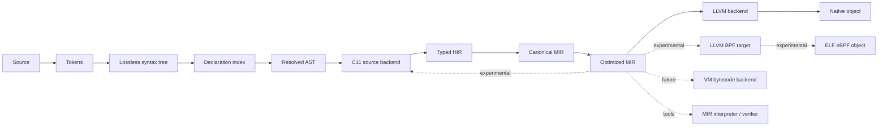

# Compiler Pipeline

## Overview

Only the dashed consumers are optional. The front end, compile-time engine, and
HIR-to-MIR contract are compiler-core components and do not depend on LLVM.

## Front end

### Source management and lexing

The compiler assigns stable file and span identifiers, preserves comments and
trivia for tooling, and emits tokens without performing semantic lookup.

### Lossless syntax tree

The syntax tree supports formatting, editor features, recovery from incomplete
programs, and precise diagnostics. It follows a Luau-derived grammar with
documented Pop Lang extensions. Parser recovery nodes do not pass unexamined
into HIR.

### Declaration index

Before checking bodies, the compiler indexes namespace/using headers, Bubble
references, declaration visibility, type names, function signatures, classes,
attributes, and constants. This makes
declaration identity available without executing compile-time code and prevents
attributes from changing how their surrounding source is parsed.

### Name and module resolution

Resolution builds Module and Bubble dependency graphs and maps every name
use to a symbol. Using directives, aliases, overload candidates, visibility, UDA
names, and type/value namespaces are resolved here. A `using` never becomes a
runtime operation.

### Type checking and inference

Type checking performs constraint generation, local inference, generic
instantiation, flow-sensitive narrowing, exhaustiveness analysis, and dispatch
selection. Every successful expression receives a static type. An unresolved
type is an error, not a request for a runtime dynamic operation.

Every semantic failure is emitted through the structured diagnostic catalog.
The type checker retains constraint reasons, selected symbols/types, and recovery
facts so quick fixes can operate on semantic data rather than message text.

## Attribute and compile-time phase

After declaration signatures are known, the compiler resolves UDA types,
type-checks attribute arguments, and evaluates those arguments as immutable
compile-time values. Compile-time functions use the normal type checker and run
in a deterministic interpreter over a restricted typed HIR subset.

The dependency engine records every source definition, constant, type,
attribute, compiler version, and explicit build input read by an evaluation.
This produces correct incremental invalidation and reproducible cache keys.
Compile-time cycles are diagnosed with a dependency and call chain.

The first language version follows these phase rules:

1. UDAs cannot change tokenization or parsing.
2. UDAs cannot create using directives, Bubble references, names, types, fields,
   or functions.
3. Attribute values must type-check before they can be queried.
4. Compile-time queries obey normal Module/Bubble visibility.
5. Attribute validation cannot observe function bodies unless a future
   capability explicitly permits it.
6. Compile-time-only values and compiler handles never enter runtime HIR/MIR.

These restrictions avoid macro-expansion/type-checking fixed points. A future
typed declaration-generation API would require a separate ADR and phase model.

## HIR construction

HIR preserves language concepts useful for diagnostics and language-level
transformations. All HIR nodes are typed and names refer to stable IDs. Surface
sugar remains only when a named later HIR pass owns its desugaring.

Representative HIR passes include:

- retaining fixed-pack construction/projection and grouped multiple assignment
  until MIR can preserve target-before-value evaluation and left-to-right stores;
- retaining resolved compound assignment until MIR lowering can emit a typed
  load-operation-store sequence;
- desugaring typed iteration protocols;
- materializing implicit numeric and subtype conversions;
- resolving class construction and method dispatch;
- closure capture analysis;
- allocation-site identity plus closed argument/result retention summaries for
  proof-directed static reclamation;
- retaining typed result propagation and registered lexical cleanup until MIR
  can emit dominated payload extraction and explicit last-in, first-out exit
  chains;
- async/coroutine transformation planning;
- exhaustiveness validation;
- monomorphization planning or generic dictionary selection;
- validating UDA targets and normalizing metadata-retention requests;
- validating ADR 0081 foreign declarations against exact trusted attributes,
  ABI types/layouts, namespace link aliases, and closed effects.

## MIR lowering

Lowering converts structured expressions into control-flow graphs. It makes
evaluation order, temporaries, calls, branches, cleanup, and failure edges
explicit. Closure environments, object allocation, tuple results, tagged
unions, and typed collection operations become backend-neutral primitives.
Result propagation becomes a typed conditional failure edge, while every edge
leaving registered cleanup scopes traverses their explicit MIR cleanup blocks
in last-in, first-out order. See ADR 0052.

Compile-time-only functions, symbol descriptors, and UDAs do not lower to
runtime MIR. ADR 0096 is the only first-release retained-metadata exception.
For an exact `@RetainMetadata(use = Metadata.Use.Codec, schemaVersion = N)`
request on an eligible record, enum, or tagged union, typed analysis constructs
the closed projection, emits and re-loads canonical
`retained-adapters.popc`, then generates the sibling `Codec.Schema<T>` Item as
verified typed HIR. The `.popc` descriptor is the sole structural schema and
generation source of truth; it is not parsed as ordinary source and never
exposes internal reflection objects.

The generated adapter uses resolved member/case IDs and ordinary typed
construction. Canonical MIR therefore contains only typed adapter calls and
closed codec operations, never descriptor parsing, field access by runtime name,
or a dynamic value. Its reachability controls runtime retention. A library's
canonical JSON `reference.metadata` may identify a public adapter and the full
`.popc` digest, but cannot copy the structural projection into JSON.

Statically bound foreign declarations are the exception to ordinary UDA
erasure: their trusted ADR 0081 consequence becomes a typed foreign identity
and exact ABI/effect contract in HIR/MIR. The original attribute value does not
become runtime reflection. Calls lower to explicit foreign transitions with
root publication, safe-point, cleanup, and unwind facts.

ADR 0093's binding generator is a tooling phase before ordinary source loading,
not compile-time execution. For one exact manifest alias and platform target it
checks one hashed canonical declarative `.popc` descriptor with the bounded
embedded parser, renders only validated source tokens, and failure-atomically
publishes reviewable Pop source, a closed C shim unit, and typed `.popc` binding
metadata. Generated source re-enters the normal parse/resolve/type pipeline.
The compiler never parses a header, invokes a generator, injects returned text,
or trusts generated metadata as a second semantic type system during analysis.
ADR 0094 callback-pair attachments are the narrow exception: preflight parses
their closed typed facts, then analysis accepts them only after exact comparison
with the normally resolved generated declaration. They never introduce names,
types, effects, or policies absent from that checked declaration.

MIR should use SSA form or block arguments. If mutable locals are convenient
during construction, a mandatory canonicalization pass converts them before
optimization and backend handoff.

## Optimization

Portable optimizations run on MIR:

- constant propagation and folding;
- dead-code and dead-block elimination;
- devirtualization using valid closed-world facts;
- escape analysis and allocation elision;
- path-sensitive lifetime-frontier analysis, activation-owned storage, and
  compiler-inferred scoped-region planning under ADR 0085;
- bounds-check elimination;
- inlining under a backend-neutral cost model;
- specialization of generics and interface calls;
- scalar replacement of aggregates.

Construction MIR first verifies ordinary managed-capable allocation semantics.
The storage-planning pass then derives `Elided`, `StaticSlot`, `ScopedRegion`,
or managed plans from complete alias, call-retention, cleanup, unwind,
cancellation, and suspension facts. Optimized MIR retains a closed proof and is
verified again. Missing facts or deterministic analysis-budget exhaustion keep
the allocation managed; a backend never repeats the analysis with weaker rules.

Target-specific instruction selection and machine cost tuning belong below the
backend interface. LLVM may repeat some optimizations; MIR optimizations still
matter for a future VM and for simplifying runtime operations.

## Backend handoff

A backend receives:

- a verified canonical `MirBubble`;
- target capabilities and data-layout facts through an abstract target query;
- runtime ABI version and feature set;
- the canonical target-specific native link plan and ABI fingerprints;
- build mode and debug/optimization settings.

It returns an artifact plus structured diagnostics. It cannot mutate compiler
global state or call back into parsing, resolution, type checking, or compile-
time evaluation.

The experimental C backend follows the same handoff after portable MIR
optimization. It emits deterministic C11 for its declared runtime-free
capability subset and rejects unsupported MIR before publishing source; it never
reconstructs semantics from Pop source text.

The experimental eBPF backend follows the same handoff after portable MIR
optimization. It derives runtime-contract requirements from MIR, resolves them
against an explicit runtime profile, validates eBPF-specific target limits,
lowers through backend-private LLVM IR, selects LLVM's BPF target, and emits an
ELF eBPF object for an explicit program kind such as XDP. Missing runtime
contracts, unsupported backend representations, floating-point behavior,
dispatch, recursion, or unproven loop behavior are diagnosed before any object
is written; see
[ADR 0071](./decisions/0071-experimental-ebpf-backend.md).

## Tooling and incremental queries

The parser, resolver, type checker, and HIR APIs work without native code
generation. Formatting uses the syntax tree; rename and navigation use resolved
symbol IDs.

Compile-time execution is an incremental query with deterministic inputs. Editor
tooling uses smaller instruction/allocation budgets and reports an incomplete
result instead of freezing on expensive work. No compile-time function may
perform hidden filesystem, environment, clock, random, process, or network I/O.

Diagnostics and quick fixes are incremental query outputs. Warning-wave policy,
suppression, presentation, and warning-as-error promotion happen after intrinsic
diagnostics are computed, preserving stable cacheable semantic results.
