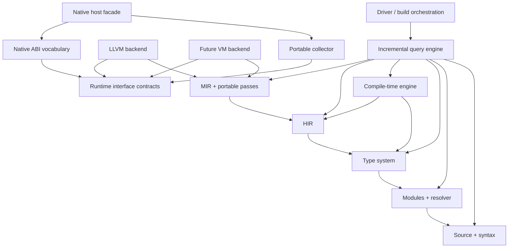

# Compiler Component Architecture

## Dependency rule

Compiler dependencies point from orchestration and lowering layers toward
stable data contracts. No front-end component imports LLVM or VM implementation
types.

Mutable root publication is part of this backend-neutral contract. PLRI pairs
each value with a canonical `RootSlot`; moving collectors rewrite current
physical tokens in place while bootstrap collectors preserve them. Backend API
capabilities—not MIR or the collector crate—authorize a runtime profile for a
selected target.



An arrow means “depends on.” Cross-cutting diagnostics, IDs, arenas, and target
contracts live in small foundation libraries with no semantic policy.

## Rust workspace boundaries

ADR 0018 selects Rust and makes these ownership areas focused Cargo crates. Rust
packages use the `pop-` prefix and live under `crates/`; the shorter labels below
describe their architectural responsibility:

```text
compiler/
  foundation/       IDs, spans, interners, diagnostics, deterministic hashing
  source/           files, line maps, source database
  syntax/           lexer, parser, lossless tree, formatter-facing API
  projects/         Workspace/Package/Bubble graph, manifests, lockfile, target discovery
  query/            incremental tracked-query engine and cancellation
  resolve/          symbols, scopes, binding, declaration index
  types/            type arena, constraints, inference, subtyping, normalization
  compile-time/     effect checker, interpreter, UDA values, dependency tracking
  hir/              typed language IR, builder, verifier, language passes
  mir/              CFG IR, builder, verifier, portable analyses/passes
  target/           backend-neutral capability and layout requests
  backend-api/      canonical MIR/backend contract and artifact diagnostics
  backends/
    c/              experimental optimized MIR-to-C11 source lowering
    llvm/           LLVM lowering and emission only
    mir-interp/      reference MIR interpreter
    vm/             future VM-private bytecode/lowering
  driver/           `pop` CLI orchestration, build graph, artifact selection
  diagnostics/      catalog, renderers, warning policy, providers, quick fixes
  documentation/    XML doc parser, semantic checks, DocIds, artifact emitter
runtime/
  interface/        versioned PLRI operations and semantic contracts
  collector/        reusable collector engine implementing PLRI GC semantics
  native-abi/       versioned native C ABI vocabulary and operation mapping
  native/           native exports, process-global state, and target adapters
tools/
  language-server/  incremental semantic client
  localization/     private typed catalogs and human presentation rendering
  formatter/        lossless syntax client
  documentation-generator/ documentation.xml to HTML/searchable output
  test-runner/      conformance and fixture orchestration
  architecture-tests/ Cargo layout and dependency-direction conformance
libraries/
  bridge/           closed typed native-foundation adapter descriptors
  internal/         trusted Pop.Internal source, intrinsics, bootstrap metadata
  macros/           standard-library-only `#[poplib]` procedural expansion
  standard/         public Pop.Standard source and API baselines
crates/extensions/
  data, ai, cli, rpc, syntax, lsp
                    independent official Package bootstrap builds
```

Cargo package names are implementation details; they do not replace Pop Lang's
Item/Module/Bubble/Package/Workspace model. The ownership and dependency
boundaries are architectural and are checked by repository tests.

## Foundation types

Foundation code provides:

- stable-in-session typed IDs;
- byte offsets and UTF-aware line/column mapping;
- source spans with macro/generated-origin chains;
- deterministic hashing and sorted iteration utilities;
- structured diagnostics and fix edits;
- immutable arenas/interners where useful;
- cancellation and query-budget tokens.

Structured diagnostic storage primitives live in foundation; diagnostic policy,
catalog, rendering, warning waves, and quick-fix providers live in the dedicated
diagnostics component to avoid semantic packages depending on terminal/LSP code.

It does not know classes, UDAs, MIR instructions, LLVM, or package policy.

## Source and syntax ownership

The syntax component owns tokens, trivia, the lossless tree, parser recovery,
and syntax-node ranges. It does not own symbols or inferred types.

Typed wrappers around generic syntax nodes are preferred for compiler code.
Malformed/recovery nodes remain representable so editor features work on broken
files. Semantic stages either translate them into explicit error nodes or stop
that declaration; they never assume a recovered node is valid syntax.

## Projects, Bubbles, Modules, and resolution

The project graph owns canonical Workspace, Package, Bubble, Module, and
namespace identities plus dependency edges. The resolver owns lexical scopes and
`SymbolId` assignment.

Its public outputs include:

- the declaration index;
- resolved namespace/using bindings and declaration visibility;
- a map from name-use syntax IDs to symbols;
- visibility decisions and diagnostics;
- dependency edges separated into type, compile-time, and runtime categories.

The resolver does not ask compile-time code to invent names. This keeps binding
deterministic and makes rename/navigation complete.

## Type-system component

The type system owns canonical semantic types, constraints, inference variables,
substitution, subtyping, generic instantiation, narrowing facts, member
selection, and typed overload/dispatch resolution.

It returns typed results or structured error types for recovery. It never
returns “unknown, decide at runtime.” Details are in
[Type-system architecture](./12-type-system-architecture.md).

## Compile-time component

The compile-time component owns:

- UDA declaration/value validation;
- the restricted effect checker;
- typed compile-time HIR;
- the deterministic interpreter;
- symbol/type query capabilities;
- fuel/allocation/depth accounting;
- dependency recording and cache serialization;
- compile-time call-chain diagnostics.

It consumes resolved symbols and type-system APIs through read-only query
interfaces. It cannot mutate symbol tables or HIR already published to another
query.

## HIR ownership

HIR is the last representation where source-language concepts are directly
modeled. Its builder consumes resolution, typing, and accepted compile-time
results. The HIR verifier checks that every ID/type/member/dispatch decision is
valid.

Language passes must declare whether they preserve source origins, type facts,
control structure, and UDA consequences. A pass cannot call LLVM or read target
machine layout.

## MIR ownership

MIR owns explicit executable semantics and portable optimization. Its APIs are
split into:

- immutable IR inspection;
- a controlled builder/editor;
- verification;
- analyses with invalidation declarations;
- transforms with before/after verification;
- deterministic textual parsing/printing.

No source symbol lookup occurs during MIR lowering. All necessary decisions are
encoded as typed HIR inputs or explicit runtime-interface operations.

ADR 0081 foreign identities, ABI layouts, effects, link aliases, and scoped
pin/handle/callback facts are such typed inputs. MIR owns portable foreign
transitions; it never owns a C symbol table, linker argument, object format, or
host library path.

## Runtime-interface ownership

PLRI contracts describe abstract allocation, strings, typed collections,
dispatch metadata, suspension, errors, Module/Bubble initialization,
GC operations, loading, and retained metadata adapters. Runtime contracts do not
expose compiler arenas or IDs. They also do not expose C symbols, platform entry
types, global runtime instances, collector storage, or backend implementation
types.

ADR 0085's scoped-region operations are semantic PLRI memory operations, not an
exposed compiler arena. Their `RegionId`, exact root map, capacity, and balanced
close contract cross the boundary; compiler analysis graphs, native addresses,
and backend stack layouts do not.

ADR 0038 separates implementation ownership below this contract. The portable
collector implements `RuntimeAdapter` and owns heap/trace/root/pin behavior
without a native ABI or process-global singleton. The native-ABI crate owns the
closed C symbol/version mapping without collector policy. The native facade
composes both, owns C exports and target/process adapters, and delegates heap
semantics to the collector.

LLVM depends on PLRI and the native ABI mapping, not on collector internals. The
MIR interpreter normally depends only on PLRI and may compose the collector for
bootstrap/conformance tests without importing the native facade. A future VM can
reuse the collector without linking a C ABI. `Pop.Internal` source/HIR/MIR uses
semantic PLRI identities; only its reviewed Rust native-bootstrap adapter may
depend on the native ABI vocabulary.

## Base-library ownership

`Pop.Internal` binds compiler semantic primitives and intrinsic IDs to portable
managed bodies/runtime entries. Its verified reference metadata is an input to
normal compilation but never a user reference.

`Pop.Standard` owns the native Pop portable public contracts and depends only on
`Pop.Internal` plus target adapters reached through PLRI. Its tier and capability
boundaries are defined in [Public standard-library architecture](./22-public-standard-library-architecture.md).
The compiler has no hard-coded knowledge of convenience APIs; syntax protocols
are identified by reserved semantic IDs declared in the base-library contract.

API baseline and intrinsic-table verification are build gates.

The two Rust bootstrap crates are internally modular under
[ADR 0035](./decisions/0035-modular-base-library-implementation.md). Their
`src/lib.rs` files are thin explicit inventories: `pop-standard` implementation
modules follow canonical public API-family ownership, while `pop-internal`
modules follow trusted runtime-service ownership. This source partition does
not create more foundational Bubbles or make Cargo modules part of Pop Lang's
semantic hierarchy.

[ADR 0037](./decisions/0037-typed-rust-foundation-adapter-attribute.md) adds two
Rust-only support crates beside those implementations. `pop-library-bridge`
owns closed build-time native adapter descriptors, and `pop-library-macros`
expands `#[poplib(...)]` without third-party parsing dependencies. Neither crate
is a foundational Bubble or a Pop source/API-definition path. Foundation
modules retain explicit descriptor inventories; generated descriptors are
verified against accepted metadata before linking.

An ordinary portable library algorithm remains library work. It changes its
owning module, focused tests, documentation, and API baseline without changing
the parser, resolver, HIR, MIR, backends, or runtime. Cross-component edits are
reserved for accepted compiler-known protocols/identities, trusted intrinsics,
PLRI services, or native ABI boundaries.

Each foundation implementation crate contains a distinct `pop/` source root.
Its conventional `src/lib.pop` and additional `.pop` Modules form one reserved
Bubble and are discovered without a compiler-side file inventory. Repository
conformance builds `Pop.Internal` before `Pop.Standard`, carries the exact
Bubble dependency into HIR/MIR, and compiles an added contribution Module as a
regression probe. The source manifests are trusted toolchain inputs, not
ordinary replaceable dependencies.

ADR 0036 makes the first contributed public functions consumable without
compiler-known IDs. The producer emits a closed typed public-function projection;
the consumer resolver indexes names from direct dependencies; and HIR/MIR carry
the original `(BubbleId, SymbolId)` identity. Metadata arenas may remap storage
IDs locally but cannot erase the owning Bubble or introduce name-based runtime
dispatch.

Official extensions are normal public Packages, not compiler components. In
particular, `Pop.Syntax` defines a reviewed public facade rather than exporting
the private syntax crate, and `Pop.Lsp` defines the protocol boundary that the
private language-server/tooling implementation consumes. Dependency direction
may point from official tooling to these public extensions, never from an
extension into compiler-private crates.

## Documentation ownership

The syntax layer owns raw `---` trivia/ranges; the documentation component owns
safe XML parsing, declaration attachment, semantic tag/`cref` validation,
`DocId`, incremental documentation queries, and `documentation.xml` emission.

Documentation consumes read-only resolver/type/effect facts. It cannot create
symbols, modify HIR/MIR, request runtime reflection, or execute code except
through the isolated documentation-test path.

## Diagnostic ownership

Semantic components create typed diagnostics using generated catalog
constructors. The diagnostics component owns severity policy, warning waves,
suppression, deduplication, ordering, rendering, machine schemas, and quick-fix
provider dispatch.

Fix providers consume immutable syntax/semantic query snapshots and return
versioned workspace edits. They cannot mutate compiler arenas or source files
directly.

The native runtime and future VM implement the same semantic operations but may
use unrelated physical layouts.

## Backend isolation

Each backend owns target layout lowering, physical calling conventions, symbol
mangling, backend-specific optimization, debug format, and artifact emission.

Backend code receives frozen verified MIR. It may add a private backend IR, but
cannot modify the source/HIR type system to fit backend limitations. Unsupported
capabilities produce a portable lowering or a structured diagnostic before
emission.

## Incremental query architecture

Compiler work is modeled as pure or tracked queries, conceptually:

```text
parse(FileId) -> SyntaxTree
index(ModuleId) -> DeclarationIndex
resolve(BubbleId) -> ResolvedBubble
signature(SymbolId) -> Type
evaluateAttribute(AttributeUseId) -> AttributeValue
typecheck(FunctionId) -> TypedBody
buildHir(BubbleId) -> HirBubble
lowerMir(FunctionId, GenericArgs) -> MirFunction
optimizeMir(BubbleId, Options) -> MirBubble
emit(BubbleId, PlatformTarget, Backend, Options) -> Artifact
```

Every query declares keys and tracked dependencies. It publishes immutable
results, can be cancelled, and never consults untracked ambient state.

Compile-time queries add dependencies on every accessed attribute/type/symbol.
Backend queries depend on target and runtime ABI versions; front-end queries do
not.

## Parallelism

Modules and function bodies can be checked in parallel after their required
signatures are available. MIR lowering and optimization can run per function
where analyses permit.

Shared interners use deterministic identity independent of thread scheduling or
are finalized in a deterministic merge. Diagnostic ordering is sorted by module,
source position, diagnostic code, and a stable tiebreaker before presentation.

Compile-time execution is logically isolated per query. Shared mutable globals
inside compile-time functions are forbidden, so evaluation order cannot affect
results.

## Error and cancellation discipline

Expected source errors return diagnostics and recovery values; they are not host
exceptions/panics. Internal invariant failure stops the affected compilation and
produces a compiler-bug report with the relevant IR dump where safe.

Long-running parser, inference, compile-time, optimization, and backend loops
poll cancellation tokens. Cancellation does not publish partial cache entries.

## Artifact boundaries

The driver may emit:

- diagnostics;
- syntax/HIR/MIR textual dumps for debugging;
- dependency metadata;
- canonical typed ADR 0096 `retained-adapters.popc` projections and their
  source-mapped generated `Codec.Schema<T>` adapters;
- deterministic C11 source as an experimental backend artifact;
- LLVM IR/bitcode as optional backend artifacts;
- native object, library, or executable files;
- deterministic generated FFI source/ABI metadata and target-specific typed
  native link plans;
- future VM bytecode.

Only explicitly versioned formats are cache/load contracts. Debug dumps can
change but must be deterministic within a compiler version.

`retained-adapters.popc` is the sole retained-adapter structural schema and
generation source. The driver may inventory its full digest in ADR 0055 JSON
control files, but no compiler component owns a parallel JSON or private
retained-schema model. Backends receive verified MIR and cannot parse or
reconstruct the descriptor.

## Verification gates

The default debug/testing pipeline verifies:

1. syntax tree ranges and parentage;
2. symbol uniqueness and visibility invariants;
3. type substitution and typed HIR invariants;
4. compile-time value canonicality and capability isolation;
5. MIR after construction and every transform;
6. C11 source, LLVM IR, or VM bytecode after backend lowering;
7. artifact/runtime ABI version compatibility;
8. architecture traceability and forbidden Lua-regression invariants.

Release builds may reduce repeated verification only after fuzzing and CI retain
the full gates.
