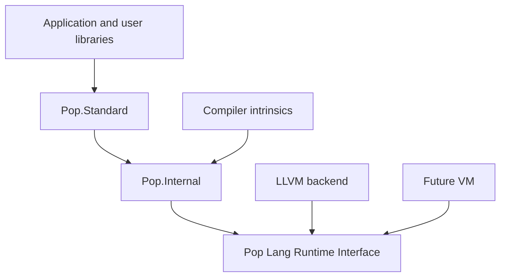

# Base Libraries

## Objective

Pop Lang ships two foundational library Bubbles:

| Bubble | Visibility | Purpose |
| --- | --- | --- |
| `Pop.Internal` | Compiler/runtime only | Intrinsic types, GC/runtime bridges, backend-neutral low-level primitives |
| `Pop.Standard` | Public | A compact BCL-inspired foundation for collections, text, I/O, time, async, networking, serialization, and common algorithms |

The split is influenced by .NET's private core library plus public BCL model.
Pop Lang adopts the layering discipline, breadth, and consistency—not the OOP
shape, long names, namespace count, or historical compatibility surface.



`Pop.Standard` cannot depend on compiler implementation packages. `Pop.Internal`
cannot depend on `Pop.Standard`. User code cannot directly reference
`Pop.Internal`.

## Shared principles

- All source-visible types, interfaces, enums, and attributes use `PascalCase`.
- Members, functions, fields, and parameters use `camelCase`.
- Only constants use `UPPER_SNAKE_CASE`.
- APIs are strongly typed and never return `Any`, dynamic boxes, or reflective
  member values.
- Expected failures use typed `Result<T, TError>` values.
- Absence uses `T?`, not sentinel objects or null-permitted references.
- Async APIs accept cancellation and do not hide blocking work.
- Public abstractions are backend-neutral across LLVM and the future VM.
- Runtime/platform differences sit behind internal adapters.
- UDAs used by the libraries are PascalCase and compile-time checked.
- Public APIs carry documentation, examples, complexity notes, thread-safety,
  allocation behavior, and error contracts.
- Records, tagged unions, plain functions, and generic algorithms are preferred
  to classes and method chains.
- Namespaces provide context so type names do not repeat it (`Json.Value`, not
  `JsonValue`; `Text.Builder`, not `StringBuilder`).

## `Pop.Internal`

### Identity and trust

`Pop.Internal` is a trusted library Bubble/`.poplib` selected by the toolchain.
Its Bubble manifest is
bound to a compatible compiler edition and PLRI ABI. It cannot be supplied or
overridden through an ordinary package dependency.

The loader verifies:

- the reserved `Pop.Internal` identity;
- compiler/runtime ABI range;
- toolchain distribution signature or trusted content hash;
- required target capabilities;
- intrinsic table version.

A mismatch is a toolchain error, not a user source diagnostic that can be
suppressed.

### Responsibilities

`Pop.Internal` owns the language/runtime implementation side of:

- primitive value operations;
- `String`, `Array<T>`, typed table storage, tuples, closures, and class objects;
- `TypeInfo` required privately by GC, dispatch, casts, and stack traces;
- allocation slow paths, write barriers, safe points, handles, and pins;
- coroutine frames and scheduler transitions;
- panic creation, propagation, and stack-unwind bridges;
- Module/Bubble initialization state;
- native/VM calling-convention adapters;
- atomics and memory-order primitives;
- platform memory, thread, time, and I/O syscalls used by public adapters;
- compiler-generated serialization/metadata adapter hooks;
- FFI transition frames and unmanaged-memory primitives.

It does not provide application-level convenience APIs, general reflection,
package resolution, UI, database clients, dependency injection, or logging
framework policy.

### Intrinsic binding

Compiler recognition uses versioned intrinsic identities, not string matching on
method names:

```text
IntrinsicEntry
  intrinsicId: IntrinsicId
  ownerType: TypeId
  signatureHash: Hash
  loweringKind: IntrinsicLoweringKind
  requiredCapabilities: CapabilitySet
```

Examples include integer checked addition, array length/indexing, string byte
access, object allocation, safe-point polls, write barriers, and coroutine
suspension.

The compiler validates each intrinsic declaration against the expected static
signature while loading `Pop.Internal`. A user type named `String` or a method
named `checkedAdd` cannot become intrinsic accidentally.

### Primitive type ownership

Source names map to canonical semantic/runtime types:

| Source type | Semantic/runtime role |
| --- | --- |
| `Boolean` | Two-value logical primitive |
| `Int8`…`Int64`, `UInt8`…`UInt64` | Fixed-width integers |
| `Int` | Alias of `Int64` |
| `Float32`, `Float64` | IEEE 754 floating point |
| `Float` | Alias of `Float64` |
| `Byte` | Alias of `UInt8` |
| `String` | Immutable valid UTF-8 string |
| `Bytes` | Explicit byte sequence abstraction |
| `Array<T>` / `{T}` | Contiguous typed sequence |
| `Table<TKey, TValue>` / `{[TKey]: TValue}` | Typed associative collection |
| `Never` | Uninhabited/non-returning type |

These names are visible through the language prelude. Their implementations are
owned by `Pop.Internal`, but user code does not write `using Pop.Internal`.

There is no universal `Object` base type. Nominal class roots, interfaces,
unions, and compile-time type handles provide the required operations without a
runtime catch-all object API.

### Internal API categories

Internal declarations carry compiler attributes such as:

```luau
@Intrinsic(IntrinsicId.ArrayLength)
@RuntimeEntry(RuntimeEntryId.AllocateObject)
@NoGc
@GcSafePoint
```

All attribute and enum names are PascalCase. These attributes live in a reserved
toolchain identity and cannot be forged by source spelling.

Internal operations are grouped by contract rather than platform:

- `Pop.Internal.Memory`
- `Pop.Internal.Gc`
- `Pop.Internal.Threading`
- `Pop.Internal.Coroutines`
- `Pop.Internal.Text`
- `Pop.Internal.Collections`
- `Pop.Internal.Panic`
- `Pop.Internal.Loader`
- `Pop.Internal.Interop`
- `Pop.Internal.Platform`

These namespaces are absent from normal reference metadata.

### Safety rules

- Every internal function declares/inherits an effect summary: allocation, GC
  transition, suspension, panic, blocking, FFI, and unsafe memory.
- Managed references in native code use handles/root scopes required by Pop GC.
- An operation marked `@NoGc` cannot call or inline an allocating/suspending
  operation.
- Internal unchecked indexing/memory functions require a preceding compiler
  proof or explicit unsafe caller contract.
- Internal panics are reserved for invariant violations, not ordinary errors.
- Toolchain debug builds verify intrinsic signatures and GC transition rules.

### Bootstrap process

1. The compiler loads a minimal built-in type schema sufficient to parse/check
   `Pop.Internal` declarations.
2. `Pop.Internal` is built using bootstrap-only intrinsic stubs.
3. The compiler reloads its reference metadata and verifies every intrinsic.
4. Native runtime stubs and portable managed bodies link into the artifact.
5. `Pop.Standard` builds against the verified reference surface.
6. The compiler rebuilds both libraries using the normal pipeline and compares
   public/intrinsic hashes for bootstrap stability.

The bootstrap schema is intentionally small. Library policy and algorithms stay
in normal Pop Lang code wherever performance and dependency rules permit.

## `Pop.Standard`

### Identity and availability

`Pop.Standard` is the public standard foundation. Every normal project receives
an implicit reference to the toolchain-compatible version plus one fixed curated
prelude generated from trusted `@Prelude` declarations.

The prelude exposes:

- primitive types/literals and `Result<T, TError>`;
- common collection types: `Array<T>`, `List<T>`, `Table<TKey, TValue>`, and
  `Set<T>`;
- `Range<T>`, `Task<T>`, `Guid`, and core function values;
- small syntax protocols: `Iterable<T>`, `Iterator<T>`, `Equal<T>`, `Order<T>`,
  `Hash<T>`, `Close`, and `AsyncClose`;
- the `Sequence` algorithm namespace for iterable transformations;
- essential functions such as `print`, `assert`, `range`, and iteration helpers;
- compiler-required PascalCase attributes;
- child namespace names such as `Math`, `Text`, `Io`, `Time`, `Async`, `Network`,
  `Http`, `Json`, `Binary`, `Locale`, `Cryptography`, and `Debug`.

`@Prelude` is a reserved PascalCase toolchain attribute accepted only in the
verified `Pop.Standard` identity. User/package declarations cannot inject global
names by copying its spelling.

The prelude does not dump every `Pop` member into file scope. Code writes
`Json.encode`, `Io.open`, or `Math.min`, which stays short and collision-resistant
without repetitive `using` directives. Adding a new prelude declaration is a reviewed
language-surface compatibility change.

Prelude bindings have the lowest name-resolution priority. Locals, declarations
in the current namespace, and explicit using aliases win; suspicious shadowing
receives an `ApiDesign`/`Style` warning. Fully qualified `Pop.Json` remains
available when a project intentionally uses `Json` for another symbol.

`Pop.Interop` remains fully qualified/explicit because it is unsafe. External
and user-library namespaces still require `using`. `pop build
--no-standard-library` exists only for runtime/toolchain development and
freestanding targets.

During the ADR 0024/0030 standalone native bootstrap, verified bootstrap
metadata exposes source-level `print(Int) -> ()` and `print(String) -> ()`
overloads by distinct stable standard-function identities. Static argument
types select one exact overload after nearer declarations have had the chance
to shadow the prelude name. HIR and MIR retain the selected identity, and the
LLVM backend lowers it to a fixed Rust `Pop.Standard` adapter. Adapter ABI
spellings are never resolved from user source. There is no catch-all printable
value; further types require typed overloads or a separately accepted static
formatting protocol.

### Namespace catalog

Catalog entries name public concepts, not classes. Unless identity/lifecycle
requires otherwise, each concept is implemented as a record, tagged union,
opaque value/handle, small interface, or namespace function. For example,
`Http.Client` may own a connection pool and justify identity, while
`Http.Request` and `Http.Response` are records.

#### `Pop` prelude

The root contains only high-frequency types/protocols/functions. Collections use
short names and no redundant C# terminology:

- `List<T>`, `Set<T>`, `Queue<T>`, `Stack<T>`, `Deque<T>`, `Heap<T, TKey>`;
- built-in `Array<T>` and `Table<TKey, TValue>` rather than `Dictionary`;
- `View<T>` for a read-only borrowed collection view;
- `Equal<T>`, `Order<T>`, and `Hash<T>` instead of comparer class families;
- `Iterable<T>`/`Iterator<T>` plus `Sequence.map`, `Sequence.filter`,
  `Sequence.fold`, and other sequence functions.

Collection operations are functions/type companions, not an inheritance tree or
fluent object graph:

```luau
List.push(players, player)
List.sort(players, byScore)

local active = Sequence.filter(players, isActive)
local names = Sequence.map(active, playerName)
```

Mutable collections are invariant. Read-only `View<T>` can be covariant where
sound. Every API documents average/worst complexity and allocation behavior.
Hash collections accept explicit `Equal<T>`/`Hash<T>` values and defend against
adversarial collision patterns.

#### `Text`

- `Text.Builder`;
- `Text.Encoding`, `Text.Utf8`, `Text.Utf16`;
- `Text.Rune` for Unicode scalar values;
- `Text.Reader`/`Text.Writer` protocols;
- `Text.format`, `Text.parse`, `Text.slice`, and Unicode operations;
- regex support only after its engine, denial-of-service limits, and compile-
  time pattern validation are specified.

`String` always contains valid UTF-8. Byte access and Unicode-scalar iteration
are distinct APIs.

#### `Io`

- opaque `Io.File`, `Io.Directory`, `Io.Path`, and `Io.Pipe` values;
- small `Io.Reader`, `Io.Writer`, and `Io.Seek` interfaces;
- `Io.open`, `Io.read`, `Io.write`, `Io.copy`, and buffered operations;
- `Io.input`, `Io.output`, and `Io.error` standard handles;
- file metadata and watching where target capabilities permit.

I/O APIs return typed errors and accept cancellation for operations that may
block. Paths are a dedicated `Path` value, not unvalidated strings at every API.

#### `Time`

- `Time.Instant` and `Time.Duration`;
- `Time.Date`, `Time.DateTime`, and `Time.Offset`;
- `Time.Zone` and timezone adapters;
- `Time.Stopwatch`, timers, and delays.

Monotonic durations and wall-clock calendar time are separate types.

#### `Math`

- typed scalar functions and constants such as `Math.PI` and `Math.E`;
- `Math.BigInt`, `Math.Decimal`, vectors, matrices, and complex values;
- checked, wrapping, and saturating helpers;
- generic numeric algorithms without runtime boxing.

#### `Async`

- prelude `Task<T>`, `CancelToken`, `CancelSource`, and `TaskGroup`;
- `Async.run`, `Async.all`, `Async.race`, `Async.sleep`, and timeout helpers;
- `Async.Channel<T>`, `Async.Mutex`, `Async.ReadWriteLock`, `Async.Semaphore`;
- `Async.Thread` and atomics for explicit low-level concurrency.

Async behavior is carried by `Task<T>` values and functions, not scheduler/
service objects. APIs do not block inside an async contract. An `Async` suffix is
used only when a same-named synchronous peer must coexist.

#### `Network` and `Http`

- `Network.Address`, `Network.Endpoint`, DNS, sockets, and datagrams;
- TLS stream contracts;
- `Http.Client`, `Http.Request`, `Http.Response`, and headers;
- common `Http.get`, `Http.post`, and streaming functions;
- cancellation, deadlines, connection pooling, and proxy hooks.

Protocol-heavy servers/frameworks can remain separate official packages.

#### `Json` and `Binary`

- `Json.Value` tagged static tree;
- `Json.Reader`, `Json.Writer`, `Json.encode`, and `Json.decode<T>`;
- `Binary.Reader`, `Binary.Writer`, and schema/version contracts;
- typed adapters generated at compile time.

`@Serializable` is PascalCase. Serialization never depends on unrestricted
runtime reflection or untyped field values.

```luau
@Serializable(version = 1)
public record PlayerSave
    playerId: Guid
    displayName: String
    score: Int
end

local encoded = Json.encode(save)
```

#### `Locale`

`Locale.Culture`, Unicode categories, collation, case mapping, and formatting.
Invariant operations remain available without loading full locale data.

#### `Cryptography`

Random-number generation, hashing, MAC, authenticated encryption, key handling,
and certificate/TLS support. `Cryptography` uses safe defaults, explicit algorithm values,
constant-time primitives where required, and zeroization-aware key containers.

#### `Debug`

Runtime tracing, structured logging contracts, metrics, activities/spans,
profiling hooks, assertions, and process/environment inspection permitted by the
target capability policy.

This namespace is unrelated to compiler `Diagnostic` objects; identical
terminology must not cause a dependency from compiler diagnostics to the
runtime BCL.

#### `Pop.Interop`

Explicit unsafe/native handles, unmanaged memory, ABI layouts, function pointers,
and scoped GC handles/pins. Most applications should not need this namespace.

### What stays outside `Pop.Standard`

The official ecosystem can provide separate packages for:

- dependency injection and hosting;
- configuration providers;
- database drivers/ORMs;
- web frameworks;
- UI frameworks;
- cloud SDKs;
- testing frameworks;
- compiler/plugin APIs;
- specialized codecs and protocols.

The standard foundation remains compact rather than becoming a home for every
official API.

## API design rules

### Shape

- Prefer namespace functions over static utility/service classes.
- Prefer records/unions for values and errors.
- Prefer `function operation(value, ...)` or contextual `Namespace.operation`
  over fluent method chains.
- Prefer small interfaces with one coherent responsibility.
- Prefer composition over required subclassing.
- Use classes only for stable identity, encapsulated mutable lifecycle, or true
  runtime dispatch.
- Classes are sealed unless extension is an intentional versioned contract.
- Avoid boolean parameter traps; use enums/options when the meaning is not
  obvious at the call site.
- Avoid overload families that differ subtly in ownership, blocking, culture, or
  error behavior.
- Do not expose implementation collection types when an iterator/read-only view
  is sufficient.
- Do not use a universal object parameter to simulate generics.
- Do not create `Manager`, `Service`, `Factory`, `Helper`, or `Utility` classes
  when a namespace function or explicit value describes the operation.
- Do not repeat namespace context in type names: prefer `Http.Client` to
  `HttpClient`, `Json.Value` to `JsonValue`, and `Text.Builder` to
  `StringBuilder`.

### Errors and resources

- Expected environmental/input failures return typed error values.
- `panic` is for broken invariants or impossible states.
- Resource ownership is explicit; cleanup protocols are deterministic.
- User finalizers are not used as resource management.
- Cancellation is explicit and composable.

### Performance

- Document whether an operation allocates, blocks, copies, pins, or retains.
- Provide span/slice/buffer-shaped APIs where they can remain memory-safe.
- Avoid hidden boxing and reflective dispatch.
- Generic collection algorithms specialize where the compiler strategy permits.
- Async operations avoid unnecessary task/closure allocation on completed paths.

### Versioning

- Public API reference metadata is diffed in CI.
- Removing or narrowing public APIs requires a major library edition.
- Adding interface requirements is breaking unless a default implementation is
  part of the original contract.
- Behavior/security fixes can be breaking only through a documented compatibility
  process.
- Internal implementation locations do not become serialized/public identity.

## Profiles and target capabilities

`Pop.Standard` has one public API identity but target manifests declare
capabilities. A freestanding/embedded target can omit namespaces whose contracts
cannot be implemented, and compilation reports a library capability diagnostic
when referenced.

Initial profiles:

- `Standard`: full supported standard foundation for desktop/server targets;
- `Minimal`: primitives, collections, text, limited I/O/time/async;
- `Freestanding`: `Pop.Internal` plus an explicitly selected tiny public surface.

Profiles cannot silently change semantics of an available API.

## Testing and quality gates

- API shape/naming analyzer with automatic fixes;
- cross-backend conformance tests;
- reference/implementation metadata compatibility checks;
- invariant globalization/timezone fixtures;
- collection differential/property/fuzz tests;
- allocation and throughput benchmarks;
- async cancellation/race tests;
- I/O/network fault injection;
- serialization schema evolution tests;
- security review/fuzzing for parsers, crypto boundaries, and paths;
- no dependency from `Pop.Internal` to `Pop.Standard`;
- no accidental public `Pop.Internal` symbols in reference metadata;
- complete checked XML documentation and compiled examples for public
  `Pop.Standard` APIs.

## .NET BCL influence boundary

The .NET BCL demonstrates the value of a broad, consistent set of foundational
types tightly integrated with the runtime and organized into discoverable
namespaces. Its framework design guidelines emphasize consistency and readable
names. Pop Lang adopts those lessons while keeping its own type system,
`Result`-based errors, UTF-8 strings, restricted reflection, Luau-like syntax,
two-library deployment model, function/data-first APIs, curated prelude, and
short contextual names. No .NET namespace/type is accepted merely because it
exists in the BCL; each API needs a Pop-specific use case and shape review.

Primary references:

- [.NET runtime libraries overview](https://learn.microsoft.com/en-us/dotnet/standard/runtime-libraries-overview)
- [.NET class libraries](https://learn.microsoft.com/en-us/dotnet/standard/class-libraries)
- [.NET framework design guidelines](https://learn.microsoft.com/en-us/dotnet/standard/design-guidelines/)
- [.NET naming guidelines](https://learn.microsoft.com/en-us/dotnet/standard/design-guidelines/general-naming-conventions)
