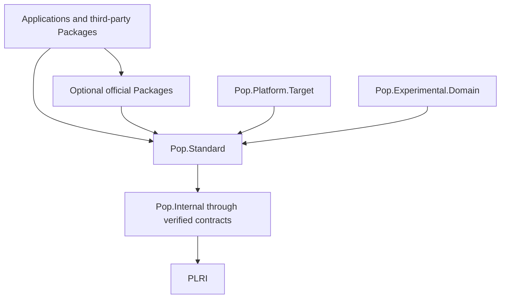

# Public Standard-Library Architecture

## Status and authority

This accepted architecture is authorized by ADRs 0030, 0031, and 0032. It
defines planned public placement and review rules. A catalog entry is not an
implementation claim. The Rust `Pop.Standard` bootstrap implements only the
surfaces explicitly marked `implemented` in the domain catalogs.

## Product rule

Pop Lang's public library must be broad, concise, statically safe, and explicit
about cost. Avoiding OOP is only one consequence. The stronger rule is that a
common task should read like the task itself:

```luau
local user = Json.decode(text, UserSchema)
local bytes = File.read(path)
local response = Http.send(request, options)
```

These sketches show API shape. Prefix `try` provides exact typed `Result`
propagation under ADR 0052. Advanced control remains available through
typed options, streams, views, buffers, and resource handles without replacing
the simple path.

## Usability contract

- A common operation generally takes one call, plus one explicit resource scope
  when lifecycle requires it.
- Defaults are safe, bounded, useful, and documented. Trust, authority, or
  destructive behavior is never hidden by a default.
- Namespace depth is earned by a stable independent subdomain. Common calls
  should normally contain one qualifier.
- A qualified name does not repeat its domain: `Json.Error`, not
  `JsonDecodeError`; `File.open`, not `File.openFile`.
- `parse` converts text to a value; `format` converts a value to text; `encode`
  and `decode` transform representations; `read` and `write` move data through
  I/O; `send` and `receive` move protocol messages.
- Synchronous and asynchronous operations share the base verb. An `Async`
  suffix is used only when both forms must coexist in the same namespace and
  overload resolution cannot distinguish them.
- Immutable option records replace builder chains. Positional parameters are
  reserved for the small set needed to understand the call.
- Opaque handles represent real resources or protocol state. Their functions
  remain direct and do not expose manager/service object graphs.
- `Builder`, `Factory`, `Manager`, `Provider`, `Service`, `Utility`, and `Helper`
  are rejected unless API review proves a distinct semantic concept and a
  clearer domain name is impossible.
- An API that is powerful but routinely cumbersome fails API review.

## Cost contract

Every stabilized public operation documents observable cost facts:

| Concern | Required contract |
| --- | --- |
| Allocation | whether the call allocates, may grow storage, or uses caller memory |
| Ownership | owned result, borrowed view, transferred handle, or copied value |
| Iteration | lazy/eager, single/multiple pass, ordering, short-circuit behavior |
| I/O | blocking or suspending, buffering, backpressure, cancellation points |
| Dispatch | direct, specialized generic, interface, or explicit function value |
| Boundary | compiler intrinsic, pure Pop, PLRI call, native call, or system call |
| Complexity | intended asymptotic bound and any stabilized measured budget |

Views and slices do not allocate and cannot outlive their owner. Iterator
adapters are lazy unless documented as materializing. Streams expose buffering
and backpressure. Caller buffers are reusable. A synchronous call does not
schedule a task. An asynchronous call may allocate task state and must identify
suspension/cancellation points. Safe convenience functions lower to the same
typed primitives exposed for advanced use; they are not layers of reflective or
dynamic dispatch.

Pop Lang does not promise that every abstraction is literally free. Benchmarks
must establish throughput, latency, allocation, code-size, and native-transition
budgets before those become release gates. Until then catalogs state intended
cost models, not measured claims.

## Distribution tiers

| Tier | Distribution | Dependency rule | Stability |
| --- | --- | --- | --- |
| Intrinsic | compiler and private `Pop.Internal` | no public dependency | language edition |
| Prelude | exact trusted subset of `Pop.Standard` | core only | strongest compatibility |
| Standard | `Pop.Standard` foundation Bubble | intrinsic/private runtime through PLRI | toolchain release |
| Platform | `Pop.Platform.<Target>` Package family | standard + target PLRI/native adapter | target-versioned |
| Official | separately selected `Pop.<Domain>` Packages | standard, other declared official Packages | independent semantic versions |
| Tooling | toolchain or development-only `Pop.<Tool>` Packages | public compiler schemas only | toolchain/schema versioned |
| Unsafe | explicit `.Unsafe`, `.Native`, or `Ffi` surface | declared native capability | no portability promise beyond contract |
| Experimental | `Pop.Experimental.<Domain>` Package | declared lower tier | no stable compatibility |
| Third-party | external Package identity | public metadata only | owner-defined |

`Pop.Standard.Core` may describe a private implementation partition, but it is
not a public Bubble or namespace. Optional official Packages are never pulled in
by the prelude. A source namespace does not imply a package dependency; package
metadata records the owning Bubble and tier.

ADR 0058 freezes the initial prelude to its exact primitive/foundation types,
trusted attributes, typed `print` overloads, and the `Sequence` namespace root.
Optional values use `T?`, not a second nominal `Option<T>`. Every other catalog
root requires explicit qualification or `using` and remains unavailable until
its catalog status and API baseline say otherwise.

## Complete planned Package families

Package names describe distribution/version boundaries; namespace roots describe
source discovery. One Package may own several related roots only where they ship
and version together. Wildcards below mean an enumerated family whose members
still require explicit dependencies and manifests.

| Package identity/family | Public roots or subdivisions | Tier/phase | Boundary |
| --- | --- | --- | --- |
| `Pop.Standard` | every catalog entry marked standard | standard; phases 0-4 | only implicit public Bubble; no optional framework dependencies |
| `Pop.Platform.Linux` | `Platform.Linux`, native adapters | platform; phases 2-8 | Linux capabilities and extensions |
| `Pop.Platform.Windows` | `Platform.Windows`, native adapters | platform; phases 2-8 | Windows capabilities and extensions |
| `Pop.Platform.Macos` | `Platform.Macos`, native adapters | platform; phases 2-8 | macOS capabilities and extensions |
| `Pop.Platform.Android` | `Platform.Android`, native adapters | platform; phases 2-8 | Android capabilities and extensions |
| `Pop.Platform.Ios` | `Platform.Ios`, native adapters | platform; phases 2-8 | iOS capabilities and extensions |
| `Pop.Platform.Web` | `Platform.Web`, web-host adapters | platform; phases 2-8 | WebAssembly/web platform capabilities |
| `Pop.Archive` | `Archive.Zip`, `Archive.Tar` | official; phase 3 | archive formats and safe extraction |
| `Pop.Compress.*` | named compression algorithm subdivisions | official; phase 3 | one licensing/native manifest per algorithm family |
| `Pop.Cluster` | `Cluster` | official/platform; phase 4 | authenticated distributed actors over explicit typed transports |
| `Pop.Http` | `Http`, `WebSocket` | official; phase 4 | client/server/protocol surface; HTTP/1.1 baseline |
| `Pop.Http2`, `Pop.Http3`, `Pop.Quic` | typed HTTP/2, HTTP/3, QUIC adapters | official; phase 4 | optional protocol implementations |
| `Pop.Identity` | `Identity` and standard protocol subdivisions | official; phase 5 | authentication/authorization values and flows |
| `Pop.Telemetry` | `Telemetry` contracts and standard exporters | official; phase 5 | exporters remain explicit dependencies |
| `Pop.Data` | `Data`, `Sql`, `Store` | official; phase 5 | typed data, database, and storage contracts |
| `Pop.Data.Sql.*` | named SQL engine/driver adapters | official/platform; phase 5 | exact driver and native requirements |
| `Pop.Data.Store.*` | named key-value/document/blob/embedded/cloud adapters | official/platform; phase 5 | one storage engine/service family per Package |
| `Pop.Cli` | `Cli`, `Command`, `Settings` | official/tooling; phase 5 | command-line applications and typed settings |
| `Pop.Schedule` | `Schedule` | official/platform; phase 5 | durable/calendar jobs and host adapters |
| `Pop.Rpc` | `Rpc` | official; phase 6 | transport-neutral generated RPC |
| `Pop.Rpc.*` | named RPC protocol adapters | official; phase 6 | exact codec/transport family |
| `Pop.Message` | `Message` contracts | official; phase 6 | broker-neutral envelopes and delivery semantics |
| `Pop.Message.*` | AMQP, MQTT, Kafka-compatible, cloud queue adapters | official; phase 6 | explicit broker/protocol Packages |
| `Pop.Email` | `Email` | official; phase 6 | MIME, SMTP, and IMAP contracts |
| `Pop.Test` | `Test` | tooling; phase 1 onward | development dependency only |
| `Pop.Benchmark` | `Benchmark` | tooling; phase 1 onward | benchmark runner/schema |
| `Pop.Diagnostic` | `Diagnostic` | tooling; phase 6 | stable diagnostic/fix schemas |
| `Pop.Syntax` | `Syntax`, `Source` | official/tooling; phase 6 | stable public source and lossless syntax facade |
| `Pop.Lsp` | `Lsp` | official/tooling; phase 6 | LSP/JSON-RPC protocol and editor contracts |
| `Pop.Package` | `Package` | tooling; phase 6 | manifests, locks, graph, registry schemas |
| `Pop.Documentation` | `Documentation` | tooling; phase 6 | checked documentation model/rendering |
| `Pop.Ffi` | `Ffi`, generated ABI bindings | unsafe; phase 6 | explicit target/ABI capability |
| `Pop.Image` | `Image` and portable codecs | official; phase 7 | image values/transforms; codecs may split |
| `Pop.Graphics.*` | raster, vector, font, GPU adapters | official/platform; phase 7 | rendering/backend families |
| `Pop.Audio.*` | audio core, codecs, device adapters | official/platform; phase 7 | real-time/codec/device boundaries |
| `Pop.Video.*` | video core, codecs, device adapters | official/platform; phase 7 | frame/codec/device boundaries |
| `Pop.Media.*` | containers, timelines, playback adapters | official/platform; phase 7 | container/platform/licensing boundaries |
| `Pop.Ui.Headless` | `Ui` core and headless renderer | official; phase 7 | first backend-neutral conformance Package |
| `Pop.Ui.Desktop`, `Mobile`, `Web` | platform UI backends | official/platform; phase 7 | target lifecycle/input/render adapters |
| `Pop.Science` | `Science`, `Geometry`, `Units`, `Statistics`, `Signal` | official; phase 7 | portable scientific algorithms |
| `Pop.Tensor.*` | tensor core and named device backends | official/platform; phase 7 | CPU/GPU/accelerator kernels and transfers |
| `Pop.Science.*` | geospatial, physics, chemistry, biology, finance, frames | official; phase 7 | separately versioned scientific domains |
| `Pop.Ai` | vendor-neutral `Ai` contracts | official; phase 8 | models, inference, generation, evaluation |
| `Pop.Ai.*` | named model formats/runtimes/remote adapters | official/platform; phase 8 | explicit vendor/device/credential dependency |
| `Pop.Device.*` | serial, USB, Bluetooth, sensor, camera, location | official/platform; phase 8 | permission and device-family boundaries |
| `Pop.Experimental.<Domain>` | proposed unstable root/subdivision | experimental | never enters normal prelude or stable aliases |

Foreseeable Package members are listed by family rather than reserving every
vendor brand. Adding a new vendor/driver/codec member inside a listed family does
not create a new architectural root, but it still needs a concrete manifest,
typed adapter contract, security/licensing review, and catalog cross-reference.

## Dependency direction



Edges point downward. Public dependency cycles are forbidden. Platform Packages
implement portable contracts or expose explicit target extensions; portable
namespaces never depend upward on them. Tooling consumes versioned compiler and
artifact schemas and is not a production runtime dependency.

## Status vocabulary

| Status | Meaning |
| --- | --- |
| `implemented` | available in the current bootstrap with conformance tests |
| `bootstrap` | Package/build identity exists, but its domain APIs remain planned |
| `prototype` | executable experiment; not a compatibility promise |
| `planned` | architectural placement only; no public implementation claim |

## Catalog map

- [Core and portable catalog](./22.1-core-and-portable-library-catalog.md)
- [System, network, and security catalog](./22.2-system-network-security-catalog.md)
- [Data, observability, and tooling catalog](./22.3-data-observability-tooling-catalog.md)
- [Application, media, and science catalog](./22.4-application-media-science-catalog.md)
- [Representative API examples](./22.5-standard-library-api-examples.md)
- [Implementation and migration plan](./22.6-standard-library-implementation-plan.md)

## Complete planned public root inventory

The following is the only authoritative root list. Catalog documents may define
subnamespaces but may not introduce a new root without updating ADR 0031, this
inventory, ownership, phase, and conformance tests.

[`libraries/catalog/public-roots.tsv`](../libraries/catalog/public-roots.tsv)
is its schema-versioned machine-readable projection. Tooling consumes that
projection rather than scraping Markdown; conformance tests require exact root
and tier agreement and one explicit implementation status per row.

<!-- namespace-roots:start -->
| Public root | Tier | Owning catalog |
| --- | --- | --- |
| `Actor` | standard/platform | system/network/security |
| `Ai` | official | application/media/science |
| `Archive` | official | core/portable |
| `Atomic` | standard/platform | system/network/security |
| `Audio` | official/platform | application/media/science |
| `Benchmark` | tooling | data/observability/tooling |
| `Bytes` | standard | core/portable |
| `Channel` | standard | system/network/security |
| `Cli` | official/tooling | data/observability/tooling |
| `Cluster` | official/platform | system/network/security |
| `Codec` | standard/official | core/portable |
| `Command` | official/tooling | data/observability/tooling |
| `Compress` | official | core/portable |
| `Crypto` | standard/platform | system/network/security |
| `Csv` | standard | core/portable |
| `Data` | official | data/observability/tooling |
| `Device` | platform/official | system/network/security |
| `Diagnostic` | tooling | data/observability/tooling |
| `Directory` | standard/platform | system/network/security |
| `Documentation` | tooling | data/observability/tooling |
| `Email` | official | application/media/science |
| `Environment` | standard/platform | system/network/security |
| `Ffi` | unsafe | application/media/science |
| `File` | standard/platform | system/network/security |
| `Geometry` | official | application/media/science |
| `Glob` | standard | core/portable |
| `Graphics` | official/platform | application/media/science |
| `Guid` | standard | core/portable |
| `Http` | official | system/network/security |
| `Identity` | official/platform | system/network/security |
| `Image` | official/platform | application/media/science |
| `Io` | standard | system/network/security |
| `Json` | standard | core/portable |
| `Locale` | standard/platform | core/portable |
| `Lsp` | official/tooling | data/observability/tooling |
| `Math` | standard | core/portable |
| `Media` | official/platform | application/media/science |
| `Memory` | standard/unsafe | system/network/security |
| `Message` | official | application/media/science |
| `Metadata` | standard/tooling | data/observability/tooling |
| `Mime` | standard | core/portable |
| `Net` | standard/platform | system/network/security |
| `Package` | tooling | data/observability/tooling |
| `Path` | standard | system/network/security |
| `Platform` | standard/platform | system/network/security |
| `Process` | standard/platform | system/network/security |
| `Random` | standard | core/portable |
| `Regex` | standard | core/portable |
| `Resource` | standard/tooling | core/portable |
| `Rpc` | official | application/media/science |
| `Schedule` | official/platform | system/network/security |
| `Science` | official | application/media/science |
| `Sequence` | standard | core/portable |
| `Settings` | official | data/observability/tooling |
| `Signal` | official | application/media/science |
| `Socket` | standard/platform | system/network/security |
| `Source` | official/tooling | data/observability/tooling |
| `Sql` | official | data/observability/tooling |
| `Statistics` | official | application/media/science |
| `Store` | official/platform | data/observability/tooling |
| `Syntax` | official/tooling | data/observability/tooling |
| `Task` | standard/platform | system/network/security |
| `Telemetry` | standard/official | data/observability/tooling |
| `Tensor` | official/platform | application/media/science |
| `Terminal` | standard/official | system/network/security |
| `Test` | tooling | data/observability/tooling |
| `Text` | standard | core/portable |
| `Time` | standard/platform | core/portable |
| `Toml` | standard | core/portable |
| `Ui` | official/platform | application/media/science |
| `Unicode` | standard | core/portable |
| `Units` | official | application/media/science |
| `Uri` | standard | core/portable |
| `Version` | standard | core/portable |
| `Video` | official/platform | application/media/science |
| `WebSocket` | official | system/network/security |
| `Xml` | standard | core/portable |
| `Yaml` | standard | core/portable |
<!-- namespace-roots:end -->

## Cross-cutting gates

Every implemented family must pass:

1. concise default and explicit advanced call-site review;
2. namespace/root ownership and dependency-tier validation;
3. positive, negative, limits, cancellation, lifecycle, and security tests;
4. allocation/copy/dispatch fixtures appropriate to its cost contract;
5. portable semantic comparison across every available backend;
6. target capability and unsupported-operation tests where applicable;
7. checked public documentation with effects, costs, examples, and migration;
8. API baseline review proving that no planned name is presented as implemented.

## Closed placement decisions

- `Json`, `Yaml`, `Xml`, `Csv`, and `Toml` are shallow roots because they are
  frequent call-site domains. `Codec` owns shared adapter/schema contracts.
- `Regex` and `Glob` are distinct roots. They share text inputs, not one public
  abstraction hierarchy.
- `Locale` owns locale data and message selection; `Resource` owns packaged
  typed assets. Neither exposes string-key maps.
- `Metadata` owns typed compile-time metadata contracts and generated/retained
  projections; domain annotations remain in their owning Packages.
- `Terminal` is the complete public name. Higher-level terminal UI is an
  optional official Package under the same root.
- `Telemetry` groups logs, traces, and metrics because their correlation,
  redaction, and exporter contracts are shared. Its subdomains remain explicit.
- `Process`, `Environment`, and `Platform` replace a broad `System` root.
- `Pop.Data` owns `Data`, `Sql`, and `Store`; transactions remain in their
  concrete SQL/storage contract rather than a root namespace.
- `Pop.Cli` owns `Cli`, `Command`, and `Settings`; low-level `Terminal` remains
  standard and separately usable.
- `Pop.Syntax` owns the stable `Syntax`/`Source` facade; `Pop.Lsp` builds on it
  and `Pop.Rpc` without exposing compiler-private crates.
- `Time` owns clocks/timers/deadlines; durable or calendar-driven jobs belong to
  optional `Schedule`.
- `Ui` and `Ai` are accepted technical forms, cased as words. Package metadata
  spells their identities `Pop.Ui` and `Pop.Ai`.
- No top-level `System`, `Runtime`, `Context`, `Config`, `Observe`, `Term`,
  `Timers`, `Transactions`, `Logging`, or `Component` namespace exists.
