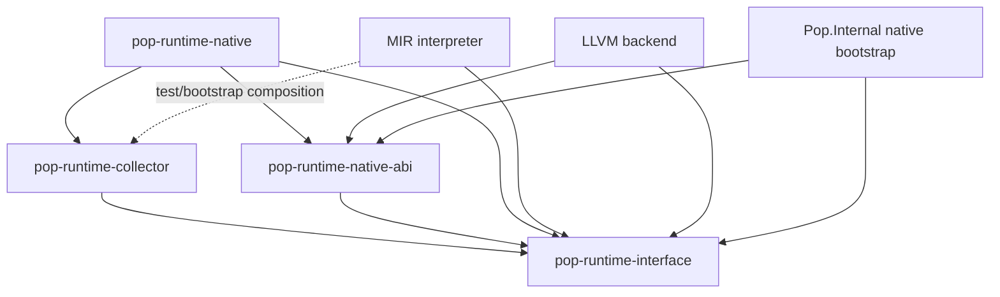

# ADR 0038: Modular Portable Runtime Implementation

- Status: accepted
- Date: 2026-07-12
- Depends on: ADR 0001, ADR 0008, ADR 0009, ADR 0018, ADR 0022, and ADR 0035
- Supersedes: the two-crate runtime inventory in ADR 0018

## Context

The bootstrap runtime began with one backend-neutral `pop-runtime-interface`
crate and one `pop-runtime-native` crate. The native crate now owns the precise
collector engine, process-global ABI state, C exports, managed strings and
process arguments, failure adapters, and target integration in one source
file. The interface crate also owns both semantic PLRI operations and their
native C symbol spellings.

That shape obscures ownership, makes the collector unnecessarily difficult to
reuse from the MIR interpreter or future VM, and forces contributors working on
GC correctness to navigate native linking and platform code. Keeping C symbol
names on `RuntimeOperation` also contradicts the accepted rule that PLRI is
backend-neutral and does not expose native ABI spellings.

More crates are useful only where they enforce real dependency and portability
boundaries. Splitting every runtime module into a package would increase build
and navigation cost without making semantics clearer.

## Decision

The Rust runtime implementation has four focused crates:

```text
runtime/
  interface/        backend-neutral PLRI values, operations, and adapter traits
  collector/        portable collector engine implementing the PLRI GC contract
  native-abi/       versioned C ABI vocabulary and semantic-operation mapping
  native/           native exports, process-global state, and target adapters
```

Their dependency direction is:



`pop-runtime-interface` is the only backend-neutral semantic contract. It owns
typed managed references, allocation and root maps, failures, GC contracts,
runtime operations, and the `RuntimeAdapter` trait. Its crate root is a thin
explicit module inventory organized by semantic responsibility. It contains no
`extern "C"` functions, `pop_rt_*` spellings, global runtime instance, platform
types, collector storage, or backend implementation dependency.

`pop-runtime-collector` owns the reusable collector engine and its heap limits,
storage, tracing, roots, pins, collection requests, statistics, and precise-map
validation. The Stage-1 `BootstrapRuntime` implements `RuntimeAdapter` here.
This crate has no native C exports, process-global singleton, platform argument
handling, linker policy, or dependency on a compiler backend or native ABI.
Production nursery/region/concurrency work grows behind this collector boundary
or a later collector implementation of the same PLRI contract.

`pop-runtime-native-abi` owns the versioned native C ABI vocabulary. It maps a
closed supported `RuntimeOperation` to its `pop_rt_*` symbol and owns ABI version
constants and physical sentinel conventions. Mapping is compile-time/static;
there is no runtime registry, string lookup, or dynamic dispatch. Unsupported
semantic operations fail closed during backend capability validation rather
than receiving an invented no-op symbol.

`pop-runtime-native` is a thin native host facade. It owns exported C functions,
the process-global synchronized collector instance used by the bootstrap static
library, UTF-8/process-entry adapters, and native trap/unwind termination. It
delegates heap semantics to a concrete collector type and does not duplicate
tracing or reachability policy.

The MIR interpreter depends on PLRI for normal compilation and uses the portable
collector only when a test or bootstrap composition requests it. The LLVM
backend consumes PLRI semantics and the native-ABI mapping but never depends on
collector internals. Its execution/link tests may link `pop-runtime-native`.
The future VM may compose the portable collector without depending on the
native ABI or native facade.

The Rust bootstrap implementation of `Pop.Internal` may depend on
`pop-runtime-native-abi` for reviewed native adapters. Pop source, HIR, and MIR
continue to bind semantic identities and PLRI operations only; they never
resolve a native symbol by spelling.

Each runtime crate has a short ownership README and a thin crate root with an
explicit module inventory. Ordinary implementation modules remain Rust modules,
not Pop Lang Modules, Bubbles, Packages, namespaces, or compatibility surfaces.

The initial collector inventory is `heap`, `access`, `trace`, and `adapter`.
The initial native-facade inventory is `identity`, `allocation`, `storage`,
`text`, `roots`, `failure`, and private process-global `state`. A module that
outgrows one reviewable runtime-service responsibility is split within its crate
before another Cargo boundary is considered.

## Performance and portability rules

- Crate separation introduces no runtime registration, heap allocation, string
  lookup, or virtual dispatch on native allocation/barrier fast paths.
- The native facade delegates to the concrete collector implementation; the
  `RuntimeAdapter` trait remains the semantic composition boundary for the MIR
  interpreter and alternate runtimes.
- Native ABI symbol selection is a constant closed match.
- The collector uses only the Rust standard library until a separately reviewed
  implementation need authorizes another dependency.
- Backend-private inlining, statepoints, stack maps, TLABs, and barrier fast
  paths remain allowed when they preserve PLRI and GC semantics.
- Performance claims require the versioned benchmark suite from the GC
  architecture. Source size or crate count is not performance evidence.
- The first executable harness uses the `pop-runtime-benchmark-v1` record schema
  and reports collector stage, workload/graph shape, roots, logical operations,
  allocations, reference stores, root/pin transitions, peak objects/slots,
  collections/reclamation/scanning, elapsed time, per-operation time, sample
  count, named profile, target architecture/operating system, build profile, and
  available parallelism. Logical counters are deterministic; timing is
  machine-specific evidence and never a language guarantee.
- The bootstrap collector owns saturating per-instance counters for successful
  allocations and actual collection/reclamation/scanning work. This is private
  implementation telemetry for tests and benchmarks, not Pop reflection or a
  source-visible runtime API.

## Consequences

- GC correctness and performance work can be built and tested without native
  linking, LLVM, process arguments, or exported symbols.
- A VM or interpreter can reuse the collector without importing a C ABI or a
  process-global runtime.
- Native ABI changes are reviewable separately from semantic PLRI changes.
- `pop-runtime-interface` becomes smaller conceptually and no longer leaks one
  backend's symbol vocabulary.
- The workspace gains two crates and more manifests, but each new crate enforces
  a dependency boundary rejected by architecture tests.
- Moving code must preserve existing ABI 1.4 behavior and bootstrap collector
  tests; this ADR does not claim the production concurrent collector is done.

## Alternatives considered

### Keep two crates and use Rust modules only

Rejected because the portable collector would remain inseparable from native
exports and platform/global state at the Cargo dependency boundary. A future VM
would have to depend on the native implementation or duplicate the collector.

### Put the collector in `pop-runtime-interface`

Rejected because a semantic contract crate must not choose heap storage,
collection scheduling, or an implementation stage.

### Give each runtime service its own crate

Rejected because strings, roots, barriers, failures, scheduling, and loading do
not all need independent package boundaries. Focused modules inside the four
ownership crates keep navigation clear without confusing host packages with Pop
Lang semantic units.

### Let each backend define native symbols independently

Rejected because duplicated symbol/version tables can drift and link silently
to incompatible runtime implementations.

### Use a runtime plugin or service registry

Rejected because runtime discovery, string dispatch, and indirect hot-path
calls weaken determinism, static integration, dead stripping, and performance.

## Required conformance tests

- the workspace contains exactly the four accepted runtime crates;
- PLRI has no native symbol spelling, C export, global runtime, platform type,
  or backend implementation dependency;
- the collector depends only on PLRI, implements `RuntimeAdapter`, and has no C
  exports, platform process adapters, or native-ABI dependency;
- native-ABI mapping is closed, unique, versioned, and rejects unsupported
  operations without a fallback symbol;
- the native facade depends on PLRI, collector, and native ABI, owns the static
  library exports, and contains no duplicate collector engine;
- LLVM depends on PLRI/native ABI but not collector internals; MIR-interpreter
  bootstrap tests compose the collector without the native facade;
- `Pop.Internal` native adapters use native ABI while source/HIR/MIR remain free
  of `pop_rt_*` spellings;
- existing allocation, precise reachability, cycles, roots, pins, safe points,
  barriers, deterministic out-of-memory, string, process-argument, and ABI 1.4
  tests continue to pass;
- runtime crate roots remain thin explicit module inventories and each ownership
  boundary is documented;
- no runtime registry, dynamic lookup, backend-specific HIR/MIR, finalizer,
  weak-reference, or conservative-scanning path is introduced;
- focused collector and native tests remain independently runnable;
- the GC benchmark harness records any future claimed allocation, throughput,
  CPU, memory, or pause regression budget.

## Documents/components affected

Runtime and ABI, compiler component architecture, GC architecture, base
libraries, implementation roadmap, closed design questions, architecture
conformance policy/tests, root Cargo workspace, PLRI, bootstrap collector,
native ABI/runtime, `Pop.Internal`, MIR interpreter, LLVM backend, and runtime
contributor documentation.
